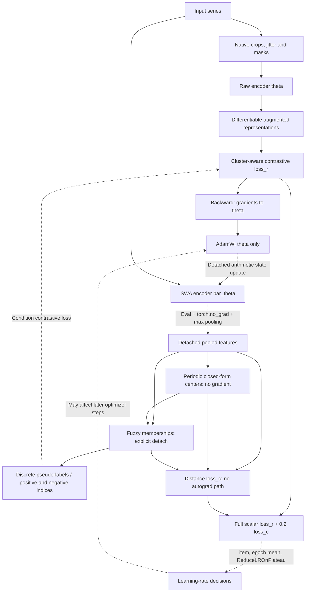

# FCACC Gradient and Method Consistency

## Executive Finding

**Recommendation: AUTHOR CLARIFICATION REQUIRED. Classification of intent: C — UNRESOLVED. Overall paper–code correspondence: PARTIAL MATCH; correspondence of the distance-loss encoder update: UNRESOLVED.**

The released distance term has no autograd path to the optimized encoder. The contrastive term does: on the tested native minibatch graphs, every full-objective encoder gradient exactly equals its contrastive-only counterpart. This proves execution behavior, not whether the authors intended it. A detached clustering branch that supplies pseudo-labels is a plausible design; no located primary source explicitly confirms that interpretation. An implementation defect is also possible and is not established here.

Audit date: 2026-10-09. Official FCACC remains pinned to `78b5e5a138ed8c83fea64e5b6668a5cded79d2dc`. FCACC remains **BLOCKED** for the faithful development/main-table reproduction pending clarification. No real-data FCACC fit, full training routine, TFMCC training or CORE-44 was run. No scientific repair was implemented.

Only this audit was added inside the Git workspace. The existing status registry, Audit 11, adapters, configurations, manuscripts and previous results were preserved. Diagnostics and primary-source evidence are external at `G:/Articoli/Articoli da Completare/LoSTer 2026/baselines/audit12-fcacc-gradient`.

## Published Objective

The final [Pattern Recognition paper](https://dumingjing.github.io/files/paper-21_Fuzzy%20cluster-aware%20contrastive%20clustering%20for%20time%20series/2026_PR_Fuzzy%20cluster-aware%20contrastive%20clustering%20for%20time%20series.pdf), 173 (2026), 112899, is authoritative here. Its retained PDF SHA256 is `494be232a54513a06dac08c5de3c1076d7900b79fdc3403a379bab0774406277`; pages 5–6 were visually checked.

| Definition | Location | Mathematical content |
|---|---|---|
| Shared representation encoder | §3.3.1, p.3 | Three augmented views use the same encoder `f`. |
| Hard negatives | §3.3.2, p.4, Eqs.1–2 | Temporal and instance mixtures. |
| Contrastive objective | §3.3.3, p.5, Eqs.3–7 | Temporal and instance terms; Eq.7 averages their sum over samples/timestamps. |
| Distance loss | §3.4, p.5, Eq.8 | $L_{cluster}=\sum_j\sum_i p_{ij}\|z_i-\mu_j\|_2^2$. |
| Membership | §3.4, Eq.9 | $p_{ij}=\|z_i-\mu_j\|_2^{2/(1-m)}/\sum_\ell\|z_i-\mu_\ell\|_2^{2/(1-m)}$, `m=1.5`. |
| Center | §3.4, Eq.10 | Membership-to-power-`m` weighted mean of representations. |
| Total loss | §3.4, Eq.11 | $L=L_{contrast}+\alpha L_{cluster}$. |
| Cluster awareness | §3.5, pp.5–6, Eqs.12–16 | Maximum membership, argmax, per-cluster quota, confidence threshold and positive index sets. |

§3.6, p.6, describes contrastive pretraining followed by dynamic cluster-aware joint optimization; §4.1.3 names AdamW. The paper specifies iterative membership/center formulas, but supplies no explicit encoder gradient/update equation, numbered optimizer pseudocode, stop-gradient instruction or SWA branch definition.

**Interpretation:** differentiating a shared-encoder distance term is natural from the additive objective; it is not an explicit prescribed autograd path. Alternating updates of memberships/centers do not by themselves settle whether the encoder receives that distance gradient.

## Official Implementation

All source references below are to the [frozen official fcacc.py](https://github.com/Du-Team/FCACC/blob/78b5e5a138ed8c83fea64e5b6668a5cded79d2dc/fcacc.py). Source SHA256: `5febedbd9f4b859ecb7e88d41555007d9e623451c972483cdb8edac023fdf6f2`.

| Operation | Exact source location | Executed behavior |
|---|---|---|
| Construct centers/raw encoder/SWA | fcacc.py:79–83 | Non-gradient CUDA center tensor; raw `FCACCEncoder`; separate `AveragedModel`, immediately updated once. |
| Pretraining | :89–118 | Raw encoder AdamW; contrastive backward; SWA update after each optimizer step; loss-based scheduler; diagnostic KMeans evaluation. |
| Joint initialization | :225–242 | Load saved raw encoder; extract averaged pooled features; fixed-random-state-0 KMeans centers converted from NumPy to an ordinary tensor. |
| Joint optimizer | :139–143 | AdamW owns only `self.encoder.parameters()`, lr0.0001. No optimizer owns SWA or centers. |
| Center schedule | :154–155 | Native closed-form update when `T % T1 == 1`; `T1=2`. |
| Membership path | :158–176 | Repeated pooled averaged features; `u.detach()`; `cmp`; `p.detach()`; generate/persist pseudo-labels; raise membership weights to `m`. |
| Distance and crop loop | :178–185 | For each cluster: raw encoder crops, averaged pooled full-series features, weighted squared distance to non-gradient center. |
| Contrastive/full/backward | :189–203 | Only the final loop's crop triplet feeds `loss_r`; `loss=loss_r+w_c*loss_c`; backward/AdamW/SWA; full average scalar feeds scheduler. |
| Center update | :275–299 | Freeze raw encoder temporarily; accumulate pooled features and `p**m`; assign numerator/denominator means; restore train/requires_grad. |
| Membership formula | :301–309 | Squared distance raised to `-1/(m-1)`, then normalized. |
| Pseudo-label rules | :311–340 | Argmax/confidence; batch quota using ceil; retain previous labels; reject confidence below0.95. |
| Pooled extraction | :382–412 | Temporarily put SWA in eval; DataLoader; **torch.no_grad()**; temporal max pooling; CPU collection; return Tensor to CUDA or NumPy; restore SWA mode. |
| Contrastive internals | :415–551 | Cluster masks and sampled mixed negatives; temporal mixes; hierarchical pooling. |
| Augmented raw forwards | :554–600 | NumPy crops; two raw cropped views plus jittered third view; all passed through the raw encoder. |

The [native encoder](https://github.com/Du-Team/FCACC/blob/78b5e5a138ed8c83fea64e5b6668a5cded79d2dc/models/encoder.py):14–16 contains input projection, 11 residual dilated blocks and dropout0.2 for depth10. Its train-mode NumPy masking and eval-mode all-valid mask are at :28–39. `tools/augmentations.py:7–22` applies additive jitter(sigma0.8); `tools/tool.py:4–37` samples positive/negative indices conditioned on pseudo-labels.

Mode history matters: native pretraining evaluation switches the raw encoder to eval (:245) without restoring train; Pretraining sets train only before its epoch loop. Joint training restores raw train mode at entry and after center/evaluation updates. This is inspected control flow, not a newly executed full-training observation. None of these behaviors was changed.

## Encoder vs SWA Graph

Let `theta` denote raw encoder parameters and `bar_theta` averaged parameters. The tested d64/h64/depth10 model has **48 parameter tensors / 276,032 scalar parameters per encoder**. The two modules have disjoint storage.

Installed PyTorch1.10 `AveragedModel` deep-copies its module. Its `update_parameters` explicitly detaches both source and destination tensors and copies an arithmetic running mean. After constructor copy count1, each batch optimizer step averages the new raw state into SWA and increments the count. This is a state update across steps, not a differentiable connection between the networks. The actual installed implementation is archived in `installed-averaged-model.txt`.

Solid edges indicate computation; dashed edges identify discrete, detached or scalar-control updates. The backward node reaches raw `theta` through `loss_r` only. `loss_c` has no gradient to either encoder or centers. SWA parameters have requires_grad=True but acquire no gradients on this graph.

## Cluster Loss Gradient

In native joint training, `u1` is produced by the averaged network inside `torch.no_grad()`; memberships are explicitly detached and centers have requires_grad=False. Consequently `loss_c.requires_grad=False`, `loss_c.grad_fn=None`. Calling its backward alone raises the expected “does not require grad” error. Every raw and SWA parameter gradient remains **None**, rather than an allocated zero tensor.

The absence is structural, independent of the sampled loss value. For a hypothetical raw-encoder distance objective with fixed memberships/centers, ordinary differentiation gives

$$
\nabla_\theta L_c=2\sum_{i,j}w_{ij}J_\theta f_\theta(x_i)^\top(f_\theta(x_i)-\mu_j)
$$

This is this audit's mathematical comparator, not an additional update rule quoted from the authors. Holding memberships/centers fixed would still permit a feature/encoder gradient. The released graph also freezes feature extraction and uses a separate averaged module.

Removing `no_grad` alone would produce gradients to **SWA**, not the optimizer-owned raw encoder; averaging remains detached. A valid proposed correction therefore needs a scientific choice of encoder, mode and feature path. No such correction was made.

## Contrastive Gradient

Native crop outputs use `self.encoder` outside no_grad. `loss_r` reaches all 48 raw parameter tensors in the fixtures. For seeds0 and1, their global L2 gradient norms were respectively **23.5111127343** and **30.2888803154**.

Every tested full-objective raw gradient was **bitwise equal** to its `loss_r` gradient; maximum absolute difference was0. A single diagnostic AdamW step on each of two disposable encoder copies, with matched state/lr/weight decay, yielded identical parameter updates for contrastive-only and full gradients. All48 tensors changed. This accounts for AdamW's independent weight decay and does not claim that gradients alone describe every parameter update.

The distance scalar can nevertheless affect **ReduceLROnPlateau**: source :195–203 accumulates the full loss and passes its epoch mean to the scheduler. This is an inspected possible influence on future learning rates; no full loss history or actual learning-rate divergence was measured.

## Pseudo-Label Influence

Cluster awareness survives: pooled features and closed-form centers determine fuzzy memberships; confident pseudo-labels determine same-cluster positive masks and hard-negative index sampling. The trainable contrastive representations then receive gradients conditioned on those discrete choices. There is no backpropagation through argmax, thresholding or index selection.

The native gradient fixture's randomly drawn centers produced all-unassigned labels. To demonstrate the conditional branch rather than claim that those centers already yielded confident clusters, a separate synthetic membership fixture was passed through native `generate_pseudo_labels`: four rows[.99,.01], four[.01,.99], empty previous labels. Native output was `[0,0,-1,-1,1,1,-1,-1]`. These are generated fixture memberships, not ground-truth labels.

On the same native augmented tensors, with RNG reset identically to700 for both seed0 comparisons, confident pseudo-labels changed `loss_r` from **9.8892202377** to **9.1884403229**, and changed gradient norm from **22.8496424891** to **23.0592423572**. Gradient hashes differed. Seed1 independently confirmed the effect (loss12.2066164017 versus11.1520156860). These are synthetic graph witnesses, not clustering scores or evidence of benchmark quality.

Native center updates matched their closed-form formula exactly, left raw encoder bytes unchanged, and produced a center tensor with requires_grad=False/grad_fn=None. Representations and centers can therefore affect later contrastive updates without a direct distance-loss gradient.

## Synthetic Autograd Evidence

**34 diagnostic checks passed / 0 failed**, plus a successful fresh-process gradient artifact reload. These checks deliberately test actual graph facts; they do **not** replace or pass Audit11's historical assertion that the distance term should backpropagate.

Existing isolated environment `wave2a-fcacc-py39-v1` was reused without installs. Python3.9.13; torch1.10.0+cu113; CUDA11.3; cuDNN8200; GTX1080; NumPy1.21.4, SciPy1.10.1, sklearn1.3.2. All31 installed distributions match [the existing complete lock](../../experiments_new/baselines2026/configs/requirements-wave2a-fcacc.lock.txt), SHA256 `3e9d70904773f833229ba43ca1ff4eaabb4c8db09142e5cf0a098cd71c0626f6`. Recommended author Python3.8.10 remains unavailable; the previously disclosed3.9 adaptation is unchanged.

Generated input:8×16×1 float32, k2; native d64/h64/depth10, B8, m1.5/w_c0.2/hard_w0.2. Python/NumPy/TorchCPU/all-CUDA seeds0,0,1. Torch/OMP/MKL/OpenBLAS threads1, cuDNN deterministic=True/benchmark=False, PYTHONHASHSEED0. Synthetic centers were drawn independently; pretraining/initialization/Finetuning were never called.

To avoid rewriting the loss, the diagnostic harness compiled **the unchanged native batch AST at fcacc.py:157–191** into an external single-batch function, adding only a return of intermediate tensors. Source methods/augmentation/losses were imported directly; no monkeypatch of official methods. Raw eval-mode positive control was a standalone native forward/max-pool/squared-sum comparator. It was not inserted into training.

| Seed0 probe | requires_grad | grad_fn | Raw parameter gradients (None / zero / nonzero) | Raw global norm | SWA gradients |
|---|---|---|---|---|---|
| loss_c alone | False | None | 48 / 0 / 0 | unavailable: all None | 48 None |
| loss_r alone | True | DivBackward0 | 0 / 0 / 48 | 23.5111127343 | 48 None |
| Full objective | True | AddBackward0 | 0 / 0 / 48 | 23.5111127343 | 48 None |
| Native pooled output / its sum | False | None | 48 / 0 / 0 | unavailable: all None | 48 None |
| Direct raw encoder output | True | TransposeBackward0 | Measured through squared pooled output below | — | Separate module |
| Direct raw pooled squared sum | True | SumBackward0 | 0 / 0 / 48 | 1373.4789548725 | 48 None |

Direct raw pooling itself had SqueezeBackward1. Copying features to CPU is not intrinsically a stop-gradient operation; the native no_grad scope is decisive, together with separation from the optimized module.

Seed0 loss_c403.4598999023, loss_r10.0619449615, full90.7539215088; seed1 loss_c508.6582031250, loss_r12.2043485641, full113.9359893799. Exact seed0 replay covered tensors' graph metadata, values, all per-parameter gradient hashes/norms, memberships, pseudo-label effects and center updates. Changing to seed1 changed gradients. Fixture elapsed times:35.519544s,9.231780s,9.281995s; first run includes CUDA startup and additional disposable-copy/SWA diagnostics. These are diagnostic times, not pipeline-training benchmarks. CPU peak RAM was not instrumented or inferred.

External evidence:
- `autograd-diagnostics.py`, SHA256 `95004e285984e963cfb29c2dd21158567dd210d93f2b49f39ef3622c58df9fea`; `native-batch-ast.json`.
- `autograd-run-{0,1,2}.json`, `autograd-summary.json`: per-parameter names, shapes, None/zero/nonzero states, norms and tensor hashes for every probe.
- `gradient-tensors.pt`: input, fixture centers, 48 contrastive and full gradients; `gradient-reload.json`: fresh-process exact equality and all48 hashes verified.
- `environment-freeze.txt`, installed SWA source, GitHub API responses, rendered final-paper pages, preservation manifests and artifact inventory.
- Seed0 input SHA256 `8c29e314b7722bb987f69a1c442808c30543ae296c347daf3b862b05ebb1f650`; fixture-center SHA256 `30631ccecd5dafb0037abeca670e9fe2edc6584e76c62450e147a5c7296670be`.

Failures retained: diagnostic attempt001 selected the parameter loop rather than epoch loop in AST and stopped before model construction; attempt002 corrected only the harness and passed34/34. Both scripts/logs are preserved. Initial paper stdout and GitHub JSON decoding failures were resolved using explicit UTF-8. Browser subpage/PDF-screenshot cache misses were covered by saved REST responses and local PDF rendering. A fresh author-PDF request failed with WinError10054; the already retained official final PDF was used with its verified hash and author-hosted web access. The first report-save action was also refused because automatic approval review reached its usage limit; after the user's continuation, the same approved action succeeded. A PowerShell Unicode transport issue in that report save was corrected using ASCII JSON escapes; scientific evidence was unaffected. Final freeze verification initially failed on a CRLF/universal-newline string comparison; normalized package records confirmed all31 distributions unchanged. Full details are in `infrastructure-attempts.json`.

Historical Audit11 remains unchanged: final FCACC55 passed/1 distance-gradient correspondence assertion failed; prior TS/FC fixture-oracle and CUDA-device infrastructure failures remain recorded there and in the unchanged Wave2A logs. No historical failure was erased or relabeled as a passed scientific correspondence test.

## Paper–Code Correspondence

**Overall: PARTIAL MATCH. The specific intended encoder-gradient treatment: UNRESOLVED.**

| Question | Assessment |
|---|---|
| Are fuzzy memberships and closed-form centers present? | MATCH at the formula level; centers are updated outside autograd. |
| Is cluster-aware contrastive feedback present? | MATCH in mechanism; source and synthetic evidence show cluster-conditioned gradients. |
| Does the distance term directly optimize the raw encoder? | Executed fact: NO. Its contribution to raw backward is absent. |
| Does the publication explicitly prescribe that direct path? | No explicit gradient/update rule identified; additive loss notation motivates, but does not uniquely specify, that interpretation. |
| Does it prescribe alternating centroid and encoder optimization in sufficient detail? | Iterative FCM formulas exist; a complete encoder/centroid alternation recipe and stop-gradient policy are not specified. |
| Could the release deliberately use a frozen clustering branch? | Yes, consistent with a teacher/discrete-label mechanism; this remains a hypothesis without author confirmation. |
| Is a defect established? | NO. A defect would follow if the authors confirm encoder optimization of the distance term was intended. |
| Is the release defensible? | Defensible as an executable cluster-guided contrastive variant; equivalence to the authors' intended full method is unconfirmed. |

Additional explicit mismatch: the visually verified printed Eq.8 uses `p_ij`, while the source distance calculation uses `p_ij**m` (:175–185). Eq.10 already uses power-`m` center weights. This could be an omitted exponent in the publication or a code/objective mismatch; no explanation was found and no exponent was changed. Source batch-local ceil quota and persistent-label logic also go beyond the equation summary. These observations caution against calling any proposed repair uniquely “paper-consistent.”

An alternating algorithm can legitimately fix memberships/centers while updating an encoder. That alone does not explain detached features. Conversely, joint optimization can operate through cluster-conditioned contrastive gradients without differentiating through the clustering procedure. The available evidence does not identify which treatment the authors intended for the separately weighted distance term. Public persistence of code is not proof of intentionality.

Audit11's gradient failure is confirmed as a graph fact. This audit qualifies the inference from that fact to “defect relative to publication,” while preserving the original report, assertion and blocked gate.

## Author Repository History

Checked public primary sources on2026-10-09. [Official repository](https://github.com/Du-Team/FCACC), its [complete main history](https://github.com/Du-Team/FCACC/commits/main/), all-state [issues](https://github.com/Du-Team/FCACC/issues?q=is%3Aissue) and [pull requests](https://github.com/Du-Team/FCACC/pulls?q=is%3Apr), [releases](https://github.com/Du-Team/FCACC/releases), tags, branches and commit comments were inspected through saved GitHub REST responses. No pagination Link was returned; all20 main commits and their file patches were retrieved. The only branch is main, whose current SHA equals the frozen SHA. There are0 issues,0 PRs,0 releases,0 tags and0 commit comments in these public responses.

| Exact commit | Date (UTC) | Relevant change |
|---|---|---|
| [a75ad146e45d03f533ca1df737a2e63c19996da4](https://github.com/Du-Team/FCACC/commit/a75ad146e45d03f533ca1df737a2e63c19996da4) | 2025-03-17 | First scientific source upload: fcacc.py, encoder, augmentation/tool modules and pseudo-label example. |
| [4737f145fabde0ca96ec08ce1010ab7be4101e7b](https://github.com/Du-Team/FCACC/commit/4737f145fabde0ca96ec08ce1010ab7be4101e7b) | 2025-03-18 | Runner defaults changed pretraining1→100 and MaxIter1→30. No graph change. |
| [78b5e5a138ed8c83fea64e5b6668a5cded79d2dc](https://github.com/Du-Team/FCACC/commit/78b5e5a138ed8c83fea64e5b6668a5cded79d2dc) | 2026-01-02 | README-only update; current frozen/main head. |

The five relevant scientific files have exactly the same Git blob IDs at initial upload and frozen head. `source-history-blob-proof.json` records that comparison; scientific path histories contain only the initial upload. No gradient/SWA/pooling/distance-loss fix was found. The existing clone is shallow: its local log alone is insufficient; the complete API history supplies the evidence. No fetch/reset moved it.

The repository's `pseudo_labels_test.py` documents confidence/quota/persistence behavior and provides no stop-gradient explanation. README offers no gradient clarification. The [author publication page](https://dumingjing.github.io/publications/) and [author arXivv1, §III-B/III-D](https://arxiv.org/html/2503.22211v1) yielded no explicit gradient-policy clarification or separate corrective supplement. The frozen tree includes dataset archives and the pseudo-label example, with no separate optimizer specification. Unrelated secondary search results were not used as evidence.

**No author clarification was found in the inspected public sources.** This does not exclude private/deleted material or unpublished intent. Queries, full API payloads and negative results are archived externally; no author was contacted.

## Reproduction Options

| Criterion | Option1: official release unchanged | Option2: differentiability correction | Option3: unresolved for faithful main table |
|---|---|---|---|
| Scientific fidelity | Exact code fidelity; intended publication objective remains uncertain. | Could match an intended direct distance update; no unique verified correction yet. | Preserves uncertainty and avoids claiming equivalence. |
| Reproducibility | Frozen source and existing lock provide a concrete executable recipe. | Requires a separately pinned, documented variant and validation. | Reproducible exclusion rationale and preserved diagnostic evidence. |
| Methodological risk | Misrepresenting the distance term as direct regularization; scheduler/pseudo-label effects must be disclosed. | Changes encoder branch/mode/features and optimization; removing no_grad alone is insufficient. | Reduced baseline coverage; must avoid treating unavailable as poor performance. |
| Fairness to FCACC | Uses authors' release but may reproduce an unintended implementation. | An unconfirmed repair could unfairly improve or degrade FCACC. | Transparent pending status; no invented score or assumed defect. |
| LoSTer comparison interpretability | Valid comparison to a precisely labeled release; paper-method equivalence unresolved. | Comparison includes a researcher-defined variant unless author confirmed. | Main-table omission explicitly attributed to unresolved reproduction, not ranking. |
| Author confirmation | Needed for faithful published-method equivalence; exact-release exploratory label alone does not settle it. | Needed before calling the correction the authors' intended method. | Seek clarification to resolve the pending exclusion. |
| Suggested paper wording | “Official FCACC release at [SHA]; distance features are detached; cluster awareness operates through contrastive conditioning.” | “FCACC variant with explicitly documented encoder-distance update [changes/author confirmation].” | “FCACC reproduction remains unresolved because the release's distance-loss gradient policy is not documented sufficiently to establish method equivalence.” |

These are prospective wording options, not manuscript edits. No option was chosen by expected accuracy, and no real-data score was generated. Option2 was **not implemented**.

## Recommended Decision

**AUTHOR CLARIFICATION REQUIRED. Use Option3 provisionally.**

Keep the faithful FCACC development/main-table gate blocked while seeking the intended branch/update policy and confirmation of the experimental release. Do not silently repair it, call it defective, or declare the official release paper-equivalent solely because it executes. Option1 becomes defensible for faithful reproduction if the authors confirm the detached distance/pseudo-label/center scheme is intended. An explicit direct-gradient requirement would justify reopening the protocol around Option2 with an author-approved implementation, rather than retroactively changing the frozen source.

The present evidence resolves graph connectivity and indirect feedback. It does not resolve author intent or prove which implementation generated the reported experiments.

## Proposed Author Clarification

Draft only; **not sent**:

> We are reproducing FCACC (Pattern Recognition173,112899) at Du-Team/FCACC commit78b5e5a138ed8c83fea64e5b6668a5cded79d2dc. In fcacc.py Finetuning (:168–191), memberships are detached and loss_c uses encode_with_pooling (:382–410), which evaluates self.net (AveragedModel) under torch.no_grad; centers also have requires_grad=False. Our small synthetic probe finds no encoder gradient from loss_c, while full-loss gradients equal loss_r gradients. Cluster-derived pseudo-labels still condition loss_r, centers update explicitly, and the full scalar drives the loss scheduler. Was this detached distance branch intentional, with encoder learning only through cluster-aware contrastive gradients, or should the distance term in Eq.11 directly update self.encoder? If direct gradients were intended, which encoder/mode/feature path and code revision reflect the reported experiments? Also, should Eq.8's membership weight be p_ij or p_ij^m, as in the release? A confirmation or reference implementation would let us reproduce the intended method without inventing a repair.

## Consequences for Baseline Readiness

FCACC remains **BLOCKED**, with a more precise interpretation: **executed distance gradient absent; publication/author intent unresolved; clarification needed**. The registry was not changed because readiness was not definitively resolved. Audit08 and Audit11 historical findings and all previous logs remain unchanged. TS2Vec stays READY WITH WARNINGS; its successful fit/checkpoint/predictions were preserved.

Readiness counts remain3 READY FOR DEVELOPMENT BENCHMARK,3 READY WITH WARNINGS,1 CONDITIONAL_NOT_IMPLEMENTED,4 BLOCKED. This clarification creates no new authorization for FCACC/TFMCC/CORE-44 training.

Preservation verification: all423 pre-existing Git-listed workspace files and all1,101 previous Wave1/1B/2A artifact files retained their initial SHA256. All41 frozen LoSTer scientific files match the checkout-filtered `loster-2026-frozen` tag bytes. Both FCACC/TS2Vec clones remain clean at their pins. Protected tracked-path diff and staged diff are empty; the existing registry diff is unchanged. HEAD remains `4b66880a3face2d26e07dbb89e16e9f950567ce3`. The only newly created workspace file is this audit; nothing was committed or pushed.

External `preservation-before.json`, `preservation-after.json`, `artifact-inventory.json` and `gradient-reload.json` make these checks inspectable. No environment install or source change occurred. **CORE-44 authorization: NO.**
